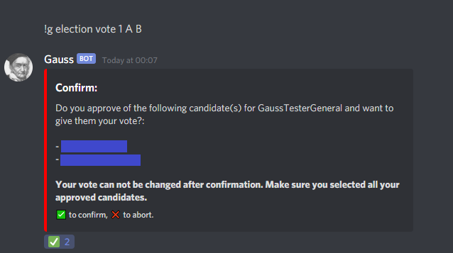

[Back to overview](../README.md)

---

## Election commands:

- [election create](#election-create)
- [election vote](#election-vote)

---

### election create

**Description**: Admins can use this command to create / schedule a new election poll.

**Parameters**:

| name          | type          | default | description                               |
| ------------- | ------------- | ------- | ----------------------------------------- |
| title         | text          | -       | Title that is to be elected.              |
| start         | Date and time | -       | Scheduled beginning of the polling in UTC |
| end           | Date and time | -       | Scheduled end of the polling in UTC.      |
| candidateName | List of users | -       | List of candidates.                       |

**Notes:**

- `start` and `end` are best given in the format of `yyyy-mm-ddTHH:MM:SS`
- If `start` and/or `end` don't contain a time of day, 12:00:00 is assumed
- `candidateNames` can be either:
  - the username (e.g. `Gauss`)
  - the username + discriminator (e.g. `Gauss#4817`)
  - or the users ID (e.G. `759385000230649916`)
- `candidateNames` might require you to put certain usernames in quotes, if they contain whitespaces (e.G. `"Gauss Bot"`)

**Aliases**: _none_

**Examples**:

- `!g election create Modiator 2020-11-01T00:00:00 2020-11-07 Gauss 204255221017214977 275813801792634880` - Schedules an election for "Modiator", starting on the 1st of november 2020 at O0:00 UTC. Ending on November 7th at 12:00 UTC. With three candidates.

---

### election vote

**IMPORTANT**: You must specify all candidates you want to approve at once. If you confirmed your choices, you can not approve additional candidates after.

**Description**: Participate in an election! This command is for a simple approval vote. You can approve just one candidate or all of them - or any number in between.

The election will be decided by who gets the most approvals. If multiple candidates can win, the candidates with the most approvals will be selected.

For example:

An Election with 6 Canidates and 2 winners and the following results:

- A: 5 approvals
- B: 6 approvals
- C: 2 approvals
- D: 1 approval
- E: 4 approvals
- F: 6 approvals

In this election, B and F would win. If this election had 3 winners, then A would also get the office.

For more details on how approval voting works, see this [wikipedia article](https://en.wikipedia.org/wiki/Approval_voting).

**Parameters**:

| name       | type                 | default | description                                                                                                               |
| ---------- | -------------------- | ------- | ------------------------------------------------------------------------------------------------------------------------- |
| electionId | number               | -       | The ID of the election you want to vote in.                                                                               |
| approvals  | List of text entries | -       | A space separated list of candidates you approve. Either by full username (as listed in the poll) or their asigned letter |

**Notes:**
- The electionId can be seen in the poll message made by the bot. Both in the title and in the "how to vote" example.
- If a username contains a whitespace, you have to put the entire username in quotes: So `"Max Mustermann#1234"` instead of `Max Mustermann#1234`
- If a candidate you specified can not be found, the bot will ask you to clarify.

**Aliases**: _none_

**Examples**:
- `!g election 1 B C` - Approve candidates "A" and "B" for the election with ID 1.
- `!g election 1 Gauss#4817 "Max Mustermann#1234"` - approve candidates "Gauss" and "Max Mustermann" for election #1.

**Two step process**:

This command uses a two-step process for comitting your vote. The bot will relay your vote in detail and ask you to verify your choice.
Click the checkmark reaction to confirm the vote or the cross reaction to abort. **Once you confirmed your vote, you can not change, amend, or retract it.**

**Hashes:**

After you confirmed your vote, the Bot will give you two alphanumeric values. These are the hash values of the state of the election before and after your vote was added. You can use these values to check the audit log once the results are posted.

If your set of hashes is not in the audit log in the exact order, the election has been tampered with or has suffered data corruption.

The Bot will also update the original Poll message with the latest hash after each vote and after closing the poll.

[See here for details on the audit log](./auditlog.md)

---
